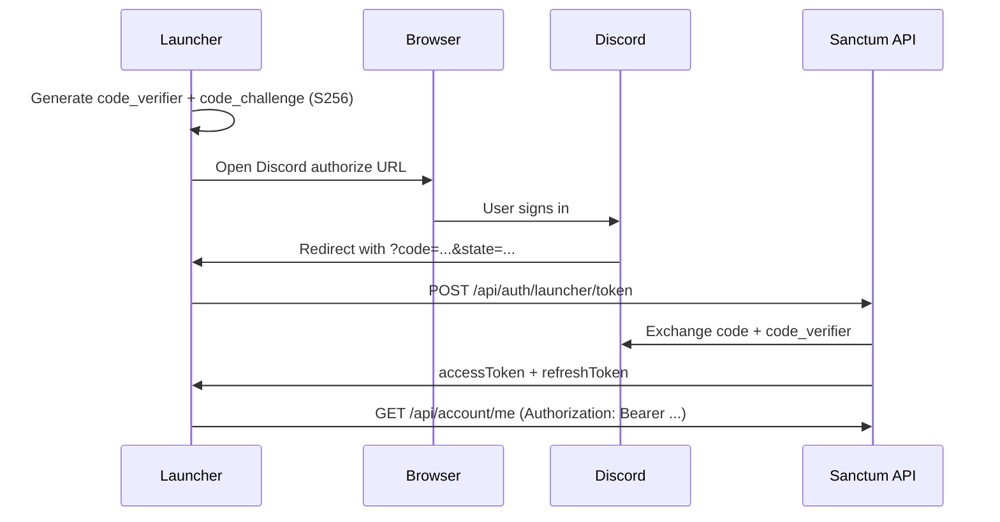

# Launcher authentication

The Sanctum website issues **Sanctum API tokens** only after Discord verifies the user. The launcher never sends a Discord ID directly, and protected account fields are only returned over **HTTPS in production**.

## Overview

| Client | Auth method | Use for |
|--------|-------------|---------|
| Website | Session cookie (`sanctum.sid`) | Browser UI, profile page |
| Launcher | OAuth2 + PKCE → Bearer JWT | Desktop client API calls |

Protected fields are defined in [DBSchema.md](../DBSchema.md). `accounts.password` is **never** returned by any endpoint.

## Transport encryption

- **Production:** all launcher and `/api/account/*` requests **must** use HTTPS. Non-HTTPS requests receive `403 HTTPS is required for protected account data`.
- **Development:** `http://localhost` is allowed for local testing.
- Encryption is provided by **TLS (HTTPS)**. Do not send protected data to plain `http://` in production.

Register the launcher redirect URI in the Discord Developer Portal (OAuth2 → Redirects), for example:

```
http://127.0.0.1:47832/auth/callback
```

Or a custom scheme:

```
sanctumxi://auth/callback
```

Set `LAUNCHER_REDIRECT_URI` in the website `.env` to match.

## Launcher login flow (PKCE)



### 1. Generate PKCE values

```text
code_verifier  = 43–128 random URL-safe characters
code_challenge = BASE64URL(SHA256(code_verifier))
```

### 2. Open Discord authorize URL

```
GET https://discord.com/oauth2/authorize
  ?client_id=YOUR_DISCORD_CLIENT_ID
  &redirect_uri=http://127.0.0.1:47832/auth/callback
  &response_type=code
  &scope=identify
  &state=RANDOM_STATE
  &code_challenge=CODE_CHALLENGE
  &code_challenge_method=S256
```

Validate `state` when the launcher receives the callback.

### 3. Exchange code for Sanctum tokens

```http
POST /api/auth/launcher/token
Content-Type: application/json

{
  "code": "DISCORD_AUTH_CODE",
  "codeVerifier": "YOUR_CODE_VERIFIER",
  "redirectUri": "http://127.0.0.1:47832/auth/callback"
}
```

**Response:**

```json
{
  "tokenType": "Bearer",
  "accessToken": "eyJ...",
  "refreshToken": "base64url...",
  "expiresIn": 3600
}
```

### 4. Call protected APIs

```http
GET /api/account/me
Authorization: Bearer eyJ...
```

Identity is taken from the signed JWT — **never** pass `discord_id` as a query parameter for protected data.

### 5. Refresh access token

```http
POST /api/auth/launcher/refresh
Content-Type: application/json

{
  "refreshToken": "PREVIOUS_REFRESH_TOKEN"
}
```

Returns a new `accessToken` and `refreshToken`. Old refresh tokens are single-use.

## API endpoints

### Public character data (authenticated owner)

```http
GET /api/account/me/public
Authorization: Bearer <token>
```

Returns non-protected fields from [DBSchema.md](../DBSchema.md) for the linked character.

### Protected account data (authenticated owner)

```http
GET /api/account/me
Authorization: Bearer <token>
```

Returns protected linkage fields (`accounts.id`, `accounts.login`, `chars.charid`, `accounts_sessions`, etc.). Requires a row in `site_discord_links`.

### Website session equivalent

The same endpoints accept the `sanctum.sid` session cookie when called from the browser.

## Database setup

Run on the game database:

```bash
mysql -h HOST -u USER -p xidb < sql/site-tables.sql
```

Link a Discord user to a game account:

```sql
INSERT INTO site_discord_links (discord_id, account_id)
VALUES ('DISCORD_SNOWFLAKE', 123);
```

## Environment variables (website)

| Variable | Purpose |
|----------|---------|
| `LAUNCHER_REDIRECT_URI` | Default launcher OAuth callback |
| `JWT_SECRET` | Signs access tokens (defaults to `SESSION_SECRET`) |
| `JWT_ACCESS_TTL_SEC` | Access token lifetime (default 3600) |
| `JWT_REFRESH_TTL_SEC` | Refresh token lifetime (default 30 days) |
| `NODE_ENV=production` | Enforces HTTPS on protected routes |

## Launcher checklist

- [ ] Use HTTPS against production API base URL
- [ ] Implement PKCE (S256) for Discord OAuth
- [ ] Store `refreshToken` securely (OS keychain / encrypted store)
- [ ] Send `Authorization: Bearer` on all account API calls
- [ ] Do not embed API secrets or private keys in the launcher binary
- [ ] Handle `401` by refreshing token or re-running Discord login
